# PythonDump Class Diagram

## Overview
This directory contains the Python code generator for the ESP32 emulator system. The architecture follows a layered design with memory management, block programming, and packet serialization.

## Class Diagram

```mermaid
classDiagram
    %% ===== ENUMS MODULE =====
    class mem_types_t {
        <<enumeration>>
        MEM_U8
        MEM_U16
        MEM_U32
        MEM_I16
        MEM_I32
        MEM_B
        MEM_F
    }
    
    class block_types_t {
        <<enumeration>>
        BLOCK_MATH
        BLOCK_SET
        BLOCK_LOGIC
        BLOCK_COUNTER
        BLOCK_CLOCK
        BLOCK_TIMER
        BLOCK_FOR
        BLOCK_SELECTOR
        BLOCK_IN_SELECTOR
        BLOCK_Q_SELECTOR
    }
    
    class packet_header_t {
        <<enumeration>>
        PACKET_H_CONTEXT_CFG
        PACKET_H_INSTANCE
        PACKET_H_BLOCK_HEADER
        PACKET_H_BLOCK_INPUTS
        PACKET_H_BLOCK_OUTPUTS
        PACKET_H_BLOCK_DATA
    }

    %% ===== MEM MODULE =====
    class instance_head_t {
        <<ctypes.Structure>>
        +context: uint16 (3 bits)
        +dims_cnt: uint16 (4 bits)
        +type: uint16 (4 bits)
        +updated: uint16 (1 bit)
        +can_clear: uint16 (1 bit)
        +reserved: uint16 (3 bits)
    }
    
    class mem_instance_t {
        +head: instance_head_t
        +dims: List[c_uint16]
        +data: Any
        +alias: str
        +my_index: int
        +pack() bytes
        +pack_data() bytes
    }
    
    class mem_context_t {
        +ctx_id: int
        +pkt_size: int
        +storage: Dict[mem_types_t, List]
        +alias_map: Dict[str, Tuple]
        +add(type, alias, data, dims, can_clear)
        +get_ref(alias) Tuple
        +generate_packets_instances() List[bytes]
        +generate_packets_scalar_data() List[bytes]
        +generate_packets_array_data() List[bytes]
        +packet_generate_cfg() bytes
    }
    
    %% ===== MEMACCES MODULE =====
    class access_packet_t {
        <<ctypes.Structure>>
        +type: uint8 (4 bits)
        +ctx_id: uint8 (3 bits)
        +is_index_resolved: uint8 (1 bit)
        +dims_cnt: uint8 (3 bits)
        +idx_type: uint8 (3 bits)
        +instance_idx: uint16
    }
    
    class Ref {
        +alias: str
        +indices: List[Tuple[bool, Union]]
        +__getitem__(item) Ref
        +_can_resolve() bool
        +_compute_resolved_index() int
        +to_bytes(manager) bytes
    }
    
    class AccessManager {
        <<singleton>>
        -_instance: AccessManager
        +contexts: List[mem_context_t]
        +get_instance() AccessManager
        +reset()
        +register_context(ctx)
        +resolve_alias(alias) Tuple
    }
    
    %% ===== BLOCK MODULE =====
    class block_cfg_t {
        <<ctypes.Structure>>
        +block_idx: uint16
        +in_connected_mask: uint16
        +block_type: uint8
        +in_cnt: uint8
        +q_cnt: uint8
    }
    
    class BlockOutputProxy {
        +block_idx: int
        +user_alias: str
        +__getitem__(idx) Ref
    }
    
    class Block {
        <<abstract>>
        +idx: int
        +block_type: block_types_t
        +ctx: mem_context_t
        +in_conn: List[Ref]
        +q_conn: List[Ref]
        +out: BlockOutputProxy
        +_in_connected: List[bool]
        +add_inputs(inputs) Block
        +_add_output(q_type, dims, data) Ref
        +_add_outputs(outputs) List[Ref]
        +get_connected_mask() int
        +pack_cfg() bytes
        +pack_inputs(manager) List[bytes]
        +pack_outputs(manager) List[bytes]
        +pack_data() List[bytes]*
    }
    
    %% ===== BLOCK SUBCLASSES =====
    class BlockMath {
        +expression: str
        +parsed_expr: MathExpression
        +__init__(idx, ctx, expression, en)
        +pack_data() List[bytes]
    }
    
    class BlockLogic {
        +expression: str
        +parsed_expr: LogicExpression
        +__init__(idx, ctx, expression, en)
        +pack_data() List[bytes]
    }
    
    class BlockSet {
        +__init__(idx, ctx, value, target, en)
        +pack_data() List[bytes]
    }
    
    class BlockFor {
        +chain_len: int
        +condition: ForCondition
        +operator: ForOperator
        +config_start: float
        +config_limit: float
        +config_step: float
        +__init__(idx, ctx, chain_len, ...)
        +pack_data() List[bytes]
    }
    
    class BlockClock {
        +period_ms: int
        +width_ms: int
        +__init__(idx, ctx, period_ms, width_ms, en)
        +pack_data() List[bytes]
    }
    
    class BlockTimer {
        +preset_time_ms: int
        +__init__(idx, ctx, preset_time_ms, en)
        +pack_data() List[bytes]
    }
    
    class BlockCounter {
        +count_up: bool
        +preset: int
        +__init__(idx, ctx, count_up, preset, en, reset)
        +pack_data() List[bytes]
    }
    
    class BlockInSelector {
        +in_count: int
        +__init__(idx, ctx, in_count, en, sel, inputs)
        +pack_data() List[bytes]
    }
    
    class BlockQSelector {
        +q_count: int
        +__init__(idx, ctx, q_count, en, sel, value)
        +pack_data() List[bytes]
    }
    
    %% ===== EXPRESSION PARSERS =====
    class OpCode {
        <<enumeration>>
        OP_VAR
        OP_CONST
        OP_ADD
        OP_MUL
        OP_DIV
        OP_COS
        OP_SIN
        OP_POW
        OP_ROOT
        OP_SUB
    }
    
    class Instruction {
        +opcode: OpCode
        +index: int
    }
    
    class MathExpression {
        +expression: str
        +constants: List[float]
        +const_map: Dict
        +instructions: List[Instruction]
        +max_input_idx: int
        -_parse()
        -_tokenize(expr) List
        -_infix_to_rpn(tokens) List
        +to_bytes() bytes
    }
    
    class LogicOpCode {
        <<enumeration>>
        VAR
        CONST
        GT
        LT
        EQ
        GTE
        LTE
        AND
        OR
        NOT
    }
    
    class LogicInstruction {
        +opcode: LogicOpCode
        +index: int
    }
    
    class LogicExpression {
        +expression: str
        +constants: List[float]
        +const_map: Dict
        +instructions: List[LogicInstruction]
        +max_input_idx: int
        -_parse()
        -_tokenize(expr) List
        -_infix_to_rpn(tokens) List
        +to_bytes() bytes
    }
    
    class ForCondition {
        <<enumeration>>
        GT
        LT
        GTE
        LTE
    }
    
    class ForOperator {
        <<enumeration>>
        ADD
        SUB
        MUL
        DIV
    }
    
    %% ===== CODE MODULE =====
    class Code {
        +user_ctx: mem_context_t
        +blocks_ctx: mem_context_t
        +blocks: List[Block]
        +_idx_counter: _IdxCounter
        +var(type, alias, data, dims)
        +add_math(expression, en, alias) BlockMath
        +add_logic(expression, en, alias) BlockLogic
        +add_set(target, value, en, alias) BlockSet
        +add_for(expr, en, alias, ...) BlockFor
        +add_clock(period_ms, width_ms, en, alias) BlockClock
        +add_timer(preset_time_ms, en, alias) BlockTimer
        +add_counter(en, reset, alias, ...) BlockCounter
        +add_selector(in_count, en, sel, inputs, alias) BlockInSelector
        +add_q_selector(q_count, en, sel, value, alias) BlockQSelector
        +generate(filename)
        -_topological_sort() List[Block]
        -_reindex_blocks()
        -_generate_packets() List[bytes]
    }
    
    class _IdxCounter {
        -_next: int
        +__call__() int
    }
    
    %% ===== RELATIONSHIPS =====
    
    %% Composition
    mem_instance_t *-- instance_head_t
    mem_instance_t --> mem_types_t : uses
    mem_context_t *-- "many" mem_instance_t : stores
    mem_context_t --> mem_types_t : uses
    
    AccessManager --> "many" mem_context_t : manages
    Ref --> access_packet_t : creates
    Ref --> AccessManager : uses
    
    Block *-- BlockOutputProxy
    Block *-- block_cfg_t : creates
    Block --> mem_context_t : uses
    Block --> block_types_t : uses
    Block *-- "many" Ref : inputs/outputs
    
    BlockMath *-- MathExpression
    BlockLogic *-- LogicExpression
    BlockFor --> ForCondition : uses
    BlockFor --> ForOperator : uses
    
    MathExpression *-- "many" Instruction
    Instruction --> OpCode : uses
    LogicExpression *-- "many" LogicInstruction
    LogicInstruction --> LogicOpCode : uses
    
    Code *-- "2" mem_context_t : user_ctx, blocks_ctx
    Code *-- "many" Block : manages
    Code *-- _IdxCounter
    Code --> AccessManager : uses
    
    %% Inheritance
    Block <|-- BlockMath
    Block <|-- BlockLogic
    Block <|-- BlockSet
    Block <|-- BlockFor
    Block <|-- BlockClock
    Block <|-- BlockTimer
    Block <|-- BlockCounter
    Block <|-- BlockInSelector
    Block <|-- BlockQSelector
    
    %% Packet generation
    Block ..> packet_header_t : uses
    Code ..> packet_header_t : uses
    mem_context_t ..> packet_header_t : uses
```



## Architecture Layers

### Layer 1: Type System (Enums.py)
- **mem_types_t**: 7 data types (U8, U16, U32, I16, I32, Bool, Float)
- **block_types_t**: Block type identifiers
- **packet_header_t**: Binary protocol headers
- **OpCode/LogicOpCode**: Expression operation codes

### Layer 2: Memory Management (Mem.py)
- **mem_instance_t**: Variable instances with metadata
- **mem_context_t**: Container for grouped variables with alias resolution
- Supports scalars and multi-dimensional arrays
- Binary packet generation for C interop

### Layer 3: Memory Access (MemAcces.py)
- **Ref**: Fluent reference builder with static/dynamic indexing
- **AccessManager**: Singleton for cross-context alias resolution
- Serializes to C-compatible access packets

### Layer 4: Block System (Block.py + BlockXxx.py)
- **Block** (abstract): Base class with input/output management
- **9 Block Types**: Math, Logic, Set, For, Clock, Timer, Counter, Selectors
- **Expression Parsers**: Convert infix math/logic to RPN bytecode
- Each block serializes to binary packets

### Layer 5: Code Orchestration (Code.py)
- **Code**: High-level API for building programs
- Factory methods for variables and blocks
- Topological sort for dependency resolution
- Complete packet generation pipeline

## Usage

```python
from Code import Code
from Enums import mem_types_t

code = Code()

# Create variables
code.var(mem_types_t.MEM_F, "speed", data=10.0)
code.var(mem_types_t.MEM_F, "result", data=0.0)

# Add blocks
clk = code.add_clock(period_ms=1000, width_ms=500, alias="clk")
calc = code.add_math(expression='"speed" * 2.0', en="clk[0]")
code.add_set(target="result", value="calc[1]")

# Generate binary packets
code.generate("output.txt")
```

## Export Options

### View in VS Code
1. Install Mermaid extensions (e.g., "Markdown Preview Mermaid Support")
2. Open `README_DIAGRAM.md`
3. Preview the markdown file

### Export to Image
1. **Online Editor**: Copy `class_diagram.mmd` to https://mermaid.live
2. **Export**: PNG, SVG, or PDF from the editor
3. **VS Code**: Use "Mermaid Markdown Preview" extension's export feature

### Export to Documentation
1. Use `class_diagram.mmd` in documentation tools (Sphinx, MkDocs, etc.)
2. Include in GitHub/GitLab markdown (renders automatically)
3. Integrate with documentation generators supporting Mermaid

## Files
- `class_diagram.mmd` - Pure Mermaid syntax file
- `README_DIAGRAM.md` - This file with embedded diagram
